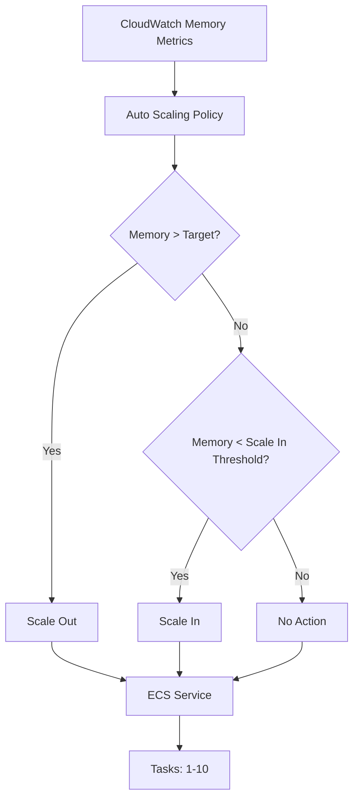
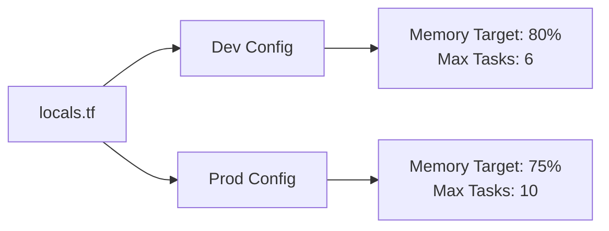

# Design Document

## Overview

Este documento descreve o design para implementar auto scaling das tasks ECS baseado exclusivamente em utilização de memória, configurando limites de 1-10 tasks com thresholds otimizados para cada ambiente. O design também inclui melhorias no .gitignore e processo de deploy automatizado.

## Architecture

### Auto Scaling Architecture



### Environment Configuration



## Components and Interfaces

### 1. Auto Scaling Target Configuration

**Component:** `aws_appautoscaling_target`
- **Min Capacity:** 1 task (both environments)
- **Max Capacity:** 6 tasks (dev), 10 tasks (prod)
- **Resource ID:** ECS service ARN
- **Scalable Dimension:** `ecs:service:DesiredCount`

### 2. Memory-Based Scaling Policy

**Component:** `aws_appautoscaling_policy` (Memory)
- **Policy Type:** TargetTrackingScaling
- **Metric:** ECSServiceAverageMemoryUtilization
- **Target Value:** 80% (dev), 75% (prod)
- **Scale Out Cooldown:** 300 seconds (5 minutes)
- **Scale In Cooldown:** 600 seconds (10 minutes)

### 3. CPU Policy Removal

**Action:** Remove existing `aws_appautoscaling_policy` for CPU
- Remove `ecs_cpu_policy` resource
- Remove CPU-related variables from locals.tf
- Clean up any CPU metric references

## Data Models

### Environment Configuration Structure

```hcl
env_config = {
  dev = {
    # Existing configurations...
    min_capacity            = 1
    max_capacity            = 6
    desired_capacity        = 1
    memory_scale_target     = 80.0
    memory_scale_in_cooldown = 600
    memory_scale_out_cooldown = 300
    # Remove cpu_scale_target
  }
  prod = {
    # Existing configurations...
    min_capacity            = 1
    max_capacity            = 10
    desired_capacity        = 1
    memory_scale_target     = 75.0
    memory_scale_in_cooldown = 600
    memory_scale_out_cooldown = 300
    # Remove cpu_scale_target
  }
}
```

### Auto Scaling Policy Configuration

```hcl
target_tracking_scaling_policy_configuration {
  predefined_metric_specification {
    predefined_metric_type = "ECSServiceAverageMemoryUtilization"
  }
  target_value       = var.env_config.memory_scale_target
  scale_out_cooldown = var.env_config.memory_scale_out_cooldown
  scale_in_cooldown  = var.env_config.memory_scale_in_cooldown
}
```

## Error Handling

### 1. Scaling Failures

**Scenario:** Auto scaling policy fails to scale
- **Detection:** CloudWatch alarms for scaling activities
- **Response:** Manual intervention required, fallback to desired capacity
- **Prevention:** Proper IAM permissions, resource limits validation

### 2. Memory Threshold Issues

**Scenario:** Memory utilization metrics unavailable
- **Detection:** CloudWatch metric absence
- **Response:** Maintain current task count, alert operations team
- **Prevention:** Ensure CloudWatch agent is properly configured

### 3. Resource Limits

**Scenario:** AWS service limits prevent scaling
- **Detection:** Auto scaling events show throttling
- **Response:** Request limit increases, adjust max capacity
- **Prevention:** Monitor service quotas proactively

## Testing Strategy

### 1. Unit Testing

**Terraform Validation:**
- `terraform validate` for syntax validation
- `terraform plan` for resource planning validation
- Variable validation for environment-specific values

### 2. Integration Testing

**Environment Testing:**
- Deploy to dev environment first
- Validate auto scaling policies are created correctly
- Test memory-based scaling triggers
- Verify CPU policies are removed

### 3. Load Testing

**Memory Pressure Testing:**
- Generate memory load on containers
- Verify scale out occurs at 80% (dev) / 75% (prod)
- Verify scale in occurs below threshold
- Test cooldown periods are respected

### 4. Deployment Testing

**Multi-Environment Deployment:**
- Test dev deployment via GitHub Actions
- Validate prod deployment after dev success
- Verify environment-specific configurations
- Test rollback procedures

## Implementation Phases

### Phase 1: Configuration Updates
1. Update `locals.tf` with new auto scaling parameters
2. Remove CPU scaling configurations
3. Update memory scaling thresholds and cooldowns

### Phase 2: ECS Service Module Updates
1. Remove CPU auto scaling policy resource
2. Update memory auto scaling policy with new parameters
3. Update auto scaling target with new capacity limits

### Phase 3: GitIgnore Improvements
1. Update .gitignore with Terraform best practices
2. Add CI/CD specific exclusions
3. Ensure security-sensitive files are excluded

### Phase 4: Deployment
1. Deploy to dev environment
2. Validate auto scaling behavior
3. Deploy to prod environment
4. Monitor and validate production scaling

## Monitoring and Observability

### CloudWatch Metrics
- ECS Service Memory Utilization
- Auto Scaling Activities
- Task Count Changes
- Scaling Policy Alarms

### Alerts
- Memory utilization approaching thresholds
- Scaling activities (scale out/in events)
- Failed scaling attempts
- Task count at minimum/maximum limits

## Security Considerations

### IAM Permissions
- Auto scaling service requires proper ECS permissions
- CloudWatch metrics access for scaling decisions
- ECS task execution permissions maintained

### Resource Access
- Ensure auto scaling doesn't compromise security groups
- Maintain network isolation during scaling events
- Preserve container security configurations