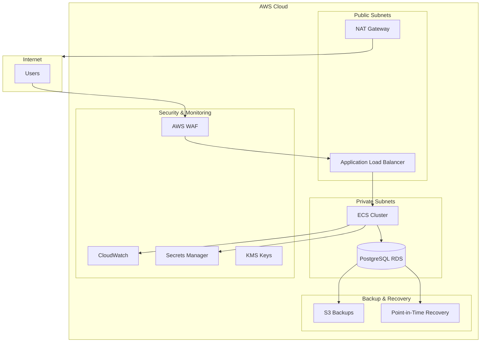
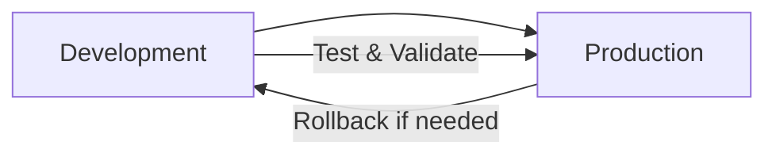

# 🏗️ Arquitetura BIA - Infraestrutura como Código

## 📋 Visão Geral

A infraestrutura BIA é implementada usando Terraform com uma arquitetura modular, suportando múltiplos ambientes (desenvolvimento e produção) com configurações otimizadas para cada cenário.

## 🎯 Princípios Arquiteturais

### ✅ Princípios Seguidos
- **Infrastructure as Code**: Toda infraestrutura versionada e reproduzível
- **Modularidade**: Componentes reutilizáveis e independentes
- **Segurança por Design**: Criptografia, least privilege, network isolation
- **Multi-Environment**: Configurações específicas para dev/prod
- **Cost Optimization**: Recursos dimensionados por ambiente
- **Observability**: Logs, métricas e monitoramento integrados
- **Backup & Recovery**: Estratégia robusta de backup com retenção diferenciada

## 🏛️ Arquitetura de Alto Nível



## 🧩 Componentes da Arquitetura

### 🌐 Rede (VPC)
```hcl
# Configuração de Rede
VPC CIDR: 172.16.48.0/20 (dev), 172.16.0.0/20 (prod)
Subnets:
  - Public:  3 AZs (us-east-1a, 1c, 1f)
  - Private: 3 AZs (us-east-1a, 1c, 1f)
```

**Características:**
- ✅ Multi-AZ para alta disponibilidade
- ✅ Isolamento de rede entre camadas
- ✅ NAT Gateway para acesso à internet (prod only)
- ✅ Internet Gateway para recursos públicos

### 🔒 Segurança

#### Security Groups
- **ALB SG**: HTTP/HTTPS from internet
- **ECS SG**: Dynamic ports from ALB
- **RDS SG**: PostgreSQL from ECS only

#### WAF (Produção)
- ✅ Rate limiting (2000 req/5min)
- ✅ Geo-blocking (CN, RU, KP)
- ✅ AWS Managed Rules (OWASP Top 10)
- ✅ Known bad inputs protection

#### Criptografia
- **KMS Keys**: Separadas para RDS e Secrets
- **S3**: Server-side encryption
- **RDS**: Encryption at rest (prod)
- **Secrets Manager**: Encrypted credentials

### 🚀 Compute (ECS)

#### Cluster Configuration
```yaml
Development:
  - Instance Type: t3.micro
  - Min Capacity: 1
  - Max Capacity: 4
  - Desired: 1

Production:
  - Instance Type: t3.micro
  - Min Capacity: 1
  - Max Capacity: 4
  - Desired: 1
```

#### Auto Scaling
- **CPU Target**: 70% (dev), 60% (prod)
- **Scale Out**: 300s cooldown
- **Scale In**: 600s cooldown (dev), 900s (prod)

### 🗄️ Banco de Dados (RDS)

#### Configurações por Ambiente
```yaml
Development:
  - Engine: PostgreSQL 17.4
  - Instance: db.t3.micro
  - Multi-AZ: false
  - Backup: 7 days retention
  - Backup Window: 03:00-04:00 UTC (11PM-12AM EST)
  - Maintenance Window: Sunday 04:00-05:00 UTC
  - Point-in-Time Recovery: enabled
  - Copy Tags to Snapshot: enabled
  - Storage: 20GB (max 100GB)

Production:
  - Engine: PostgreSQL 17.4
  - Instance: db.t3.micro
  - Multi-AZ: true
  - Backup: 30 days retention
  - Backup Window: 03:00-04:00 UTC (11PM-12AM EST)
  - Maintenance Window: Sunday 04:00-05:00 UTC
  - Point-in-Time Recovery: enabled
  - Final Snapshot: enabled
  - Copy Tags to Snapshot: enabled
  - Storage: 20GB (max 100GB)
  - Performance Insights: enabled
```

#### 💾 Estratégia de Backup
```yaml
Backup Features:
  - RTO (Recovery Time Objective): < 4 horas
  - RPO (Recovery Point Objective): < 24 horas
  - Automated Daily Backups: enabled
  - Cross-AZ Replication: automatic (prod)
  - Incremental Backups: automatic
  - Encrypted Backups: KMS (prod)
```

### ⚖️ Load Balancer (ALB)

#### Características
- **Type**: Application Load Balancer
- **Scheme**: Internet-facing
- **Health Check**: HTTP / (200,302)
- **Stickiness**: Disabled
- **Idle Timeout**: 60s

### 📊 Monitoramento

#### CloudWatch
- **Log Groups**: ECS container logs
- **Metrics**: CPU, Memory, Network, Backup metrics
- **Retention**: 7 days (dev), 30 days (prod)

#### Alerting
- **CPU High**: >70% for 2 periods
- **CPU Low**: <30% for 2 periods
- **Backup Failures**: Immediate notification
- **Auto Scaling**: Based on CPU metrics

## 🔄 State Management

### S3 Backend Configuration
```hcl
# Migrado de DynamoDB para S3 Object Locking
Backend:
  - Bucket: tf-nh
  - Encryption: AES256
  - Versioning: Enabled
  - Object Lock: Native S3 locking
  - No DynamoDB dependency
```

**Benefícios da Migração:**
- ✅ Redução de custos (~$6/ano)
- ✅ Simplificação da infraestrutura
- ✅ Locking nativo do S3
- ✅ Menor complexidade operacional

## 🏷️ Estratégia de Tags

### Tags Padrão
```hcl
common_tags = {
  Project      = "BIA"
  Owner        = "Nelson Holanda"
  ManagedBy    = "Terraform"
  Environment  = var.environment
  CostCenter   = "Engineering"
  Application  = "BIA"
}
```

### Tags Específicas por Ambiente
```hcl
# Desenvolvimento
dev_tags = {
  Backup      = "Optional"
  Compliance  = "Development"
  DataClass   = "Internal"
}

# Produção
prod_tags = {
  Backup      = "Required"
  Compliance  = "SOC2"
  DataClass   = "Confidential"
}
```

## 💰 Otimização de Custos

### Estratégias Implementadas

#### Por Ambiente
```yaml
Development:
  - Instâncias menores (t3.micro)
  - Single-AZ RDS
  - Backup 7 dias
  - Sem WAF
  - Sem KMS

Production:
  - Instâncias otimizadas
  - Multi-AZ para HA
  - Backup estendido (30 dias)
  - WAF habilitado
  - KMS para criptografia
```

#### Economia Realizada
- **DynamoDB Removal**: $6/ano
- **Right-sizing**: Instâncias adequadas por ambiente
- **Storage Optimization**: Auto-scaling de storage RDS
- **Backup Optimization**: Retenção diferenciada por ambiente

## 🔧 Deployment Strategy

### Ambientes


### Scripts de Deploy
- **`deploy.sh`**: Script unificado para ambos ambientes
- **GitHub Actions**: Workflows automatizados
- **Backend Configs**: Separados por ambiente

### Processo de Deploy
1. **Development First**: Sempre testar em dev
2. **Validation**: Terraform plan + manual review
3. **Production**: Deploy com confirmação manual
4. **Rollback**: Procedimentos documentados

## 🛡️ Disaster Recovery

### Backup Strategy
```yaml
RDS Backups:
  - Development: 7 days retention
  - Production: 30 days retention
  - Point-in-time recovery available
  - Cross-AZ replication (prod)

State Files:
  - S3 versioning enabled
  - Cross-region replication (future)
  - Backup configurations maintained
```

### Recovery Procedures
1. **RDS Recovery**: Point-in-time restore
2. **State Recovery**: S3 versioning rollback
3. **Infrastructure**: Terraform re-deployment
4. **Application**: Container image rollback

### Recovery Objectives
- **RTO**: < 4 horas
- **RPO**: < 24 horas
- **Availability**: 99.9% (dev), 99.95% (prod)

## 📈 Escalabilidade

### Horizontal Scaling
- **ECS Tasks**: 1-20 tasks (prod), 1-10 (dev)
- **EC2 Instances**: 1-4 instances
- **RDS**: Read replicas (future enhancement)

### Vertical Scaling
- **Instance Types**: Upgradeable via Terraform
- **Storage**: Auto-scaling enabled
- **Memory/CPU**: Configurable per environment

## 🔮 Roadmap Futuro

### Melhorias Planejadas
- [ ] **Multi-Region**: Disaster recovery cross-region
- [ ] **Container Insights**: Métricas avançadas
- [ ] **Service Mesh**: Istio/App Mesh
- [ ] **GitOps**: ArgoCD integration
- [ ] **Cost Optimization**: Spot instances para dev
- [ ] **Security**: AWS Config rules
- [ ] **Monitoring**: Prometheus + Grafana
- [ ] **Backup**: Cross-region backup replication

### Otimizações Técnicas
- [ ] **Blue/Green Deployments**
- [ ] **Canary Releases**
- [ ] **Auto-scaling Predictivo**
- [ ] **Reserved Instances** para prod
- [ ] **Lambda Functions** para automação
- [ ] **Automated Backup Testing**

---

**Arquitetura mantida por:** Nelson Holanda  
**Última atualização:** 30 de Julho de 2025  
**Versão:** 2.1 (Com estratégia de backup otimizada)