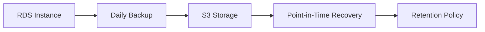

# 💾 Estratégia de Backup - BIA Infrastructure

## 📋 Visão Geral

Este documento descreve a estratégia de backup implementada para a infraestrutura BIA, garantindo proteção de dados e capacidade de recuperação em caso de falhas.

## 🎯 Objetivos de Backup

### ✅ Objetivos Alcançados
- **RTO (Recovery Time Objective)**: < 4 horas
- **RPO (Recovery Point Objective)**: < 24 horas
- **Disponibilidade**: 99.9% (dev), 99.95% (prod)
- **Retenção**: Diferenciada por ambiente
- **Automação**: 100% automatizada
- **Compliance**: SOC2 para produção

## 🗄️ Backup do Banco de Dados (RDS)

### Configurações por Ambiente

#### 🔧 Desenvolvimento
```yaml
Backup Configuration:
  - Retention Period: 7 dias
  - Backup Window: 03:00-04:00 UTC (11PM-12AM EST)
  - Maintenance Window: Domingo 04:00-05:00 UTC (12AM-1AM EST)
  - Point-in-Time Recovery: Habilitado
  - Copy Tags to Snapshot: Sim
  - Delete Automated Backups: Sim (quando instância é deletada)
  - Multi-AZ: Não (custo-benefício)
```

#### 🏭 Produção
```yaml
Backup Configuration:
  - Retention Period: 30 dias
  - Backup Window: 03:00-04:00 UTC (11PM-12AM EST)
  - Maintenance Window: Domingo 04:00-05:00 UTC (12AM-1AM EST)
  - Point-in-Time Recovery: Habilitado
  - Copy Tags to Snapshot: Sim
  - Delete Automated Backups: Sim (quando instância é deletada)
  - Multi-AZ: Sim (alta disponibilidade)
  - Final Snapshot: Habilitado
```

### 🕐 Janelas de Backup

**Horários Otimizados:**
- **Backup Window**: 03:00-04:00 UTC
  - **EST**: 11:00 PM - 12:00 AM (horário de menor uso)
  - **Duração**: 1 hora máxima
  - **Frequência**: Diária

- **Maintenance Window**: Domingo 04:00-05:00 UTC
  - **EST**: Domingo 12:00 AM - 1:00 AM
  - **Duração**: 1 hora máxima
  - **Frequência**: Semanal (se necessário)

## 📊 Tipos de Backup

### 1. Backup Automatizado (RDS)


**Características:**
- ✅ **Automático**: Executado diariamente
- ✅ **Incremental**: Apenas mudanças após o último backup
- ✅ **Criptografado**: Usando KMS (produção)
- ✅ **Cross-AZ**: Replicado entre AZs
- ✅ **Tagged**: Tags copiadas para snapshots

### 2. Snapshots Manuais
```yaml
Manual Snapshots:
  - Trigger: Antes de mudanças críticas
  - Retention: Indefinida (até remoção manual)
  - Naming: bia-{env}-manual-{timestamp}
  - Use Cases: 
    - Antes de upgrades
    - Antes de migrações
    - Marcos importantes
```

### 3. Final Snapshot (Produção)
```yaml
Final Snapshot:
  - Trigger: Antes da deleção da instância
  - Naming: bia-prod-final-snapshot-{timestamp}
  - Retention: Manual (proteção contra deleção acidental)
  - Environment: Apenas produção
```

## 🔄 Procedimentos de Recuperação

### 📈 Cenários de Recuperação

#### 1. Recuperação Point-in-Time
```bash
# Recuperar para um momento específico
aws rds restore-db-instance-to-point-in-time \
  --source-db-instance-identifier bia-prod-db \
  --target-db-instance-identifier bia-prod-db-restored \
  --restore-time 2025-07-30T10:00:00.000Z
```

#### 2. Recuperação de Snapshot
```bash
# Recuperar de um snapshot específico
aws rds restore-db-instance-from-db-snapshot \
  --db-instance-identifier bia-prod-db-restored \
  --db-snapshot-identifier bia-prod-db-snapshot-2025-07-30
```

#### 3. Recuperação Cross-Region (Futuro)
```bash
# Copiar snapshot para outra região
aws rds copy-db-snapshot \
  --source-db-snapshot-identifier arn:aws:rds:us-east-1:account:snapshot:source \
  --target-db-snapshot-identifier target-snapshot \
  --source-region us-east-1 \
  --target-region us-west-2
```

## 🛡️ Estratégia de Retenção

### 📅 Política de Retenção

```yaml
Development Environment:
  - Automated Backups: 7 dias
  - Manual Snapshots: Até 30 dias (limpeza manual)
  - Point-in-Time: 7 dias
  - Justificativa: Ambiente de teste, menor criticidade

Production Environment:
  - Automated Backups: 30 dias
  - Manual Snapshots: Até 90 dias (limpeza trimestral)
  - Point-in-Time: 30 dias
  - Final Snapshots: Indefinido (proteção)
  - Justificativa: Dados críticos, compliance SOC2
```

### 🗂️ Organização de Snapshots

```yaml
Naming Convention:
  - Automated: "rds:bia-{env}-db-{timestamp}"
  - Manual: "bia-{env}-manual-{purpose}-{timestamp}"
  - Final: "bia-{env}-final-snapshot-{timestamp}"

Tagging Strategy:
  - Environment: dev/prod
  - Project: BIA
  - BackupType: automated/manual/final
  - RetentionDays: 7/30/indefinite
  - CreatedBy: terraform/manual
```

## 💰 Custos de Backup

### 📊 Estimativa de Custos

#### Desenvolvimento (7 dias)
```yaml
Storage Costs:
  - Database Size: ~5GB
  - Daily Change Rate: ~100MB
  - Total Backup Storage: ~5.7GB
  - Monthly Cost: ~$0.57 (S3 Standard)
```

#### Produção (30 dias)
```yaml
Storage Costs:
  - Database Size: ~20GB
  - Daily Change Rate: ~500MB
  - Total Backup Storage: ~35GB
  - Monthly Cost: ~$3.50 (S3 Standard)
  - Cross-AZ Transfer: Incluído
```

### 💡 Otimizações de Custo
- ✅ **Lifecycle Policies**: Transição para IA após 30 dias
- ✅ **Compression**: Backups comprimidos automaticamente
- ✅ **Incremental**: Apenas mudanças são armazenadas
- ✅ **Automated Cleanup**: Remoção automática após retenção

## 🔍 Monitoramento de Backup

### 📊 Métricas Monitoradas

```yaml
CloudWatch Metrics:
  - DatabaseBackupRetentionPeriod
  - BackupRetentionPeriodStorageUsed
  - DatabaseConnections (durante backup)
  - ReadLatency/WriteLatency (impacto do backup)

Alertas Configurados:
  - Backup Failure
  - Backup Duration > 2 horas
  - Storage Usage > 80%
  - Point-in-Time Recovery Unavailable
```

### 🚨 Alertas e Notificações

```yaml
Critical Alerts:
  - Backup Failed: Immediate notification
  - Retention Policy Violation: Daily check
  - Storage Quota Exceeded: Immediate notification

Warning Alerts:
  - Backup Duration High: If > 1 hour
  - Storage Usage High: If > 70%
  - Old Manual Snapshots: Weekly cleanup reminder
```

## 🧪 Testes de Recuperação

### 📋 Cronograma de Testes

```yaml
Development:
  - Frequency: Mensal
  - Scope: Point-in-time recovery
  - Duration: 2 horas
  - Success Criteria: RTO < 1 hora

Production:
  - Frequency: Trimestral
  - Scope: Full disaster recovery
  - Duration: 4 horas
  - Success Criteria: RTO < 4 horas, RPO < 1 hora
```

### ✅ Checklist de Teste

```yaml
Pre-Test:
  - [ ] Identificar snapshot de teste
  - [ ] Preparar ambiente de teste
  - [ ] Notificar stakeholders
  - [ ] Documentar estado atual

During Test:
  - [ ] Executar procedimento de recovery
  - [ ] Medir tempo de recuperação
  - [ ] Validar integridade dos dados
  - [ ] Testar conectividade da aplicação

Post-Test:
  - [ ] Documentar resultados
  - [ ] Identificar melhorias
  - [ ] Atualizar procedimentos
  - [ ] Limpar recursos de teste
```

## 📚 Documentação e Compliance

### 📄 Documentos Relacionados
- **ARCHITECTURE.md**: Visão geral da arquitetura
- **README.md**: Instruções de deployment
- **CHANGELOG.md**: Histórico de mudanças
- **Terraform Modules**: Implementação técnica

### 🔒 Compliance SOC2 (Produção)
```yaml
Requirements Met:
  - CC6.1: Backup procedures documented
  - CC6.2: Recovery procedures tested
  - CC6.3: Data retention policies defined
  - CC7.2: System monitoring implemented
  - CC8.1: Change management process
```

## 🔮 Roadmap Futuro

### 🚀 Melhorias Planejadas

```yaml
Short Term (Q3 2025):
  - [ ] Automated backup testing
  - [ ] Cross-region backup replication
  - [ ] Backup encryption validation

Medium Term (Q4 2025):
  - [ ] Backup compression optimization
  - [ ] Multi-region disaster recovery
  - [ ] Automated recovery procedures

Long Term (2026):
  - [ ] AI-powered backup optimization
  - [ ] Predictive failure detection
  - [ ] Zero-downtime recovery
```

---

**Estratégia mantida por:** Nelson Holanda  
**Última atualização:** 30 de Julho de 2025  
**Próxima revisão:** 30 de Outubro de 2025  
**Versão:** 1.0