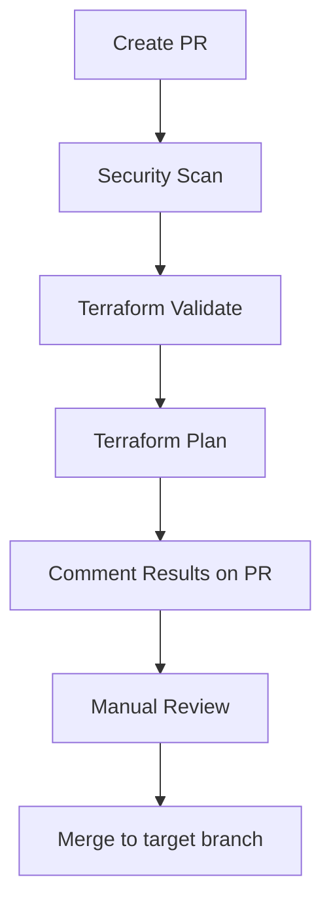
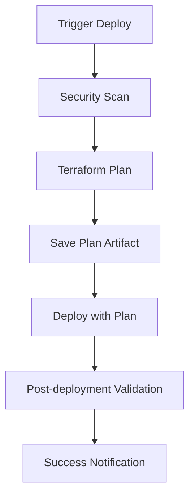

# 🚀 CI/CD Pipeline Documentation

## 📋 Overview

Este projeto implementa um pipeline CI/CD robusto para Terraform com foco em segurança, validação e processo de revisão estruturado.

## 🔄 Workflows Implementados

### 1. **Terraform PR Review** (`.github/workflows/terraform-pr.yml`)
**Trigger:** Pull Requests para branches `dev` ou `prod`

**Funcionalidades:**
- ✅ Validação de formato Terraform
- ✅ Validação de configuração
- ✅ Security scanning (tfsec + Checkov)
- ✅ Terraform plan com comentário automático no PR
- ✅ Upload de resultados para GitHub Security tab

### 2. **Deploy Development** (`.github/workflows/deploy-dev.yml`)
**Trigger:** Manual (workflow_dispatch) com confirmação obrigatória

**Funcionalidades:**
- 🔒 Confirmação obrigatória "DEPLOY-DEV"
- 📋 Terraform plan e apply
- 🚀 Deploy com validação pós-deployment
- 📊 Outputs dos recursos criados

### 3. **Deploy Production** (`.github/workflows/deploy-prod.yml`)
**Trigger:** Push para branch `prod` ou manual

**Funcionalidades:**
- 🔒 Security scanning com falha hard
- 📋 Plan separado do deploy
- 🛡️ Environment protection (requer configuração)
- ✅ Validação pós-deployment
- 📈 Artifacts com retenção de 90 dias

### 4. **Terraform Validation** (`.github/workflows/terraform-validate.yml`)
**Trigger:** Push, schedule diário, ou manual

**Funcionalidades:**
- 🔍 Validação contínua para ambos ambientes
- 🚨 Detecção de drift de infraestrutura
- 📝 Criação automática de issues para drift
- 🔒 Auditoria de segurança agendada

## 🔒 Security Scanning

### **Ferramentas Utilizadas:**

#### **tfsec**
- **Propósito:** Static analysis para Terraform
- **Configuração:** `.tfsec/config.yml`
- **Foco:** Vulnerabilidades específicas da AWS

#### **Checkov**
- **Propósito:** Policy-as-code scanning
- **Configuração:** `.checkov.yml`
- **Foco:** Compliance e best practices

### **Configurações de Segurança:**

```yaml
# Desenvolvimento: soft_fail = true (warnings)
# Produção: soft_fail = false (bloqueia deploy)
```

## 📊 Process Flow

### **Pull Request Flow:**


### **Deployment Flow:**


## 🛠️ Local Development

### **Validação Local:**
```bash
# Executar todas as validações localmente
./validate-local.sh dev

# Executar para produção
./validate-local.sh prod
```

### **Ferramentas Necessárias:**
```bash
# Terraform
brew install terraform

# tfsec
brew install tfsec

# Checkov
pip install checkov
```

## 🔧 Configuration

### **GitHub Secrets Necessários:**
- `AWS_ACCESS_KEY_ID` - AWS Access Key
- `AWS_SECRET_ACCESS_KEY` - AWS Secret Key

### **Environment Protection (Recomendado):**
1. Vá para Settings > Environments
2. Crie environment "production"
3. Configure required reviewers
4. Configure deployment branches (apenas `prod`)

### **Branch Protection Rules:**
```yaml
# Para branch 'prod'
- Require pull request reviews
- Require status checks to pass
- Require branches to be up to date
- Include administrators
```

## 📈 Monitoring e Alertas

### **Drift Detection:**
- **Frequência:** Diário às 2:00 UTC
- **Ação:** Cria issue automática se drift detectado
- **Labels:** `infrastructure-drift`, `{environment}`, `automated`

### **Security Audits:**
- **Frequência:** Diário (schedule) ou manual
- **Artifacts:** Resultados salvos por 90 dias
- **Integration:** GitHub Security tab

## 🚨 Troubleshooting

### **Problemas Comuns:**

#### **Security Scan Failures:**
```bash
# Verificar configurações
cat .tfsec/config.yml
cat .checkov.yml

# Executar localmente
tfsec . --config-file .tfsec/config.yml
checkov -f .checkov.yml
```

#### **Plan Failures:**
```bash
# Verificar backend
terraform init -backend-config=backend-dev.hcl

# Validar configuração
terraform validate

# Debug plan
terraform plan -var="environment=dev" -detailed-exitcode
```

#### **Drift Detection Issues:**
```bash
# Verificar estado atual
terraform refresh -var="environment=prod"

# Comparar com configuração
terraform plan -var="environment=prod"

# Investigar mudanças
aws cloudtrail lookup-events --lookup-attributes AttributeKey=ResourceName,AttributeValue=bia-prod-cluster
```

## 📋 Best Practices

### **Pull Requests:**
1. ✅ Sempre criar PR para mudanças
2. ✅ Revisar plan output cuidadosamente
3. ✅ Verificar security scan results
4. ✅ Testar em dev antes de prod

### **Deployments:**
1. ✅ Dev: Manual com confirmação "DEPLOY-DEV"
2. ✅ Prod: Automático após push para branch prod
3. ✅ Sempre validar pós-deployment
4. ✅ Monitorar logs e métricas

### **Security:**
1. ✅ Nunca ignorar security warnings em prod
2. ✅ Revisar e corrigir findings regularmente
3. ✅ Manter ferramentas atualizadas
4. ✅ Documentar exceções de segurança

## 🔗 Links Úteis

- [Terraform Best Practices](https://www.terraform.io/docs/cloud/guides/recommended-practices/index.html)
- [tfsec Documentation](https://aquasecurity.github.io/tfsec/)
- [Checkov Documentation](https://www.checkov.io/)
- [GitHub Actions Documentation](https://docs.github.com/en/actions)

## 📞 Support

Para problemas com CI/CD:
1. Verificar workflow logs no GitHub Actions
2. Executar validação local com `./validate-local.sh`
3. Revisar configurações de security scanning
4. Consultar documentação das ferramentas