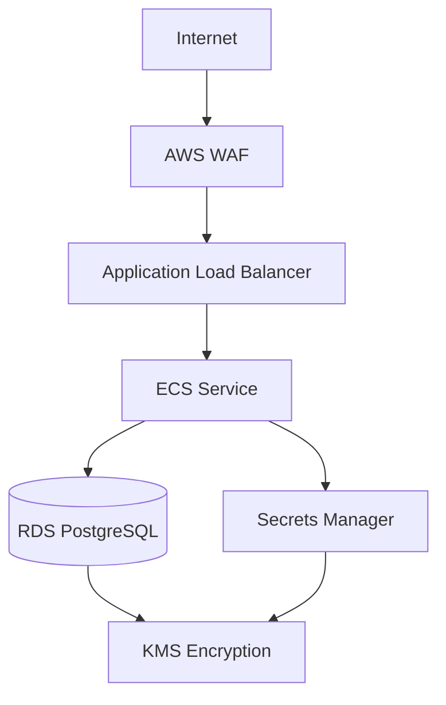

# 🚀 BIA ECS Infrastructure

[](https://www.terraform.io/)
[](https://aws.amazon.com/)
[](LICENSE)

Infraestrutura como código (IaC) para o sistema BIA usando Terraform na AWS com suporte a múltiplos ambientes, CI/CD automatizado e melhores práticas de segurança. Projeto totalmente sincronizado entre código Terraform e recursos AWS.

## 🏗️ Arquitetura

### **Componentes Principais**



### **Recursos AWS**

| Componente | Desenvolvimento | Produção |
|------------|-----------------|----------|
| **VPC** | 172.16.48.0/20 | 172.16.0.0/20 |
| **ECS Instances** | t3.micro (1-4) | t3.micro (1-4) |
| **RDS** | db.t3.micro (Single-AZ) | db.t3.micro (Multi-AZ) |
| **WAF** | ❌ Desabilitado | ✅ Habilitado |
| **KMS** | ❌ Desabilitado | ✅ Habilitado |
| **Container Insights** | ❌ Desabilitado | ✅ Habilitado |
| **Backup Retention** | 1 dia | 30 dias |

## 📁 Estrutura do Projeto

```
bia-kiro-tf/
├── 📄 main.tf                      # Configuração principal
├── 📄 variables.tf                 # Variáveis do projeto
├── 📄 locals.tf                   # Configurações por ambiente
├── 📄 outputs.tf                  # Outputs do Terraform
├── 📄 backend-dev.hcl             # Backend S3 para dev
├── 📄 backend-prod.hcl            # Backend S3 para prod
├── 🔧 deploy.sh                   # Script de deploy
├── 🔧 setup-secrets.sh            # Script para configurar secrets
├── 🔧 validate-local.sh           # Validação local
├── 📁 .github/workflows/          # GitHub Actions
│   ├── deploy-dev.yml             # Deploy manual dev
│   ├── deploy-prod.yml            # Deploy automático prod
│   ├── destroy-dev.yml            # Destroy manual dev
│   └── destroy-prod.yml           # Destroy manual prod
└── 📁 modules/                    # Módulos Terraform
    ├── alb/                       # Application Load Balancer
    ├── cloudwatch/                # Logs e monitoramento
    ├── ecs-cluster/               # ECS Cluster
    ├── ecs-service/               # ECS Service
    ├── iam/                       # Identity and Access Management
    ├── kms/                       # Key Management Service
    ├── rds/                       # Database PostgreSQL
    ├── security-groups/           # Security Groups
    ├── vpc/                       # Virtual Private Cloud
    └── waf/                       # Web Application Firewall
```

## 🚀 Quick Start

### **Pré-requisitos**
- [Terraform](https://www.terraform.io/downloads.html) 1.6.6+
- [AWS CLI](https://aws.amazon.com/cli/) configurado
- Credenciais AWS com permissões adequadas
- Bucket S3 `tf-nh` para backend

### **1. Configurar Credenciais AWS**
```bash
# Configure suas credenciais AWS
aws configure

# Verificar configuração
aws sts get-caller-identity
```

### **2. Configurar Secrets**
```bash
# Executar script de setup de secrets
./setup-secrets.sh dev    # Para desenvolvimento
./setup-secrets.sh prod   # Para produção
```

### **3. Deploy Local**
```bash
# Deploy para desenvolvimento (recomendado - com limpeza automática)
./deploy.sh dev apply

# Deploy para produção (recomendado - com limpeza automática)
./deploy.sh prod apply

# Ou deploy manual (se necessário)
# Para desenvolvimento
terraform init -backend-config=backend-dev.hcl -reconfigure
./cleanup-secrets.sh dev  # Limpar secrets órfãos
terraform apply -auto-approve

# Para produção
terraform init -backend-config=backend-prod.hcl -reconfigure
./cleanup-secrets.sh prod  # Limpar secrets órfãos
terraform apply -var-file=terraform-prod.tfvars -auto-approve
```

### **4. Validação**
```bash
# Validar configuração local
terraform validate

# Verificar recursos criados
terraform output

# Verificar status dos serviços ECS
aws ecs describe-services --cluster bia-dev-cluster --services bia-dev-service
aws ecs describe-services --cluster bia-prod-cluster --services bia-prod-service
```

## 🔄 CI/CD Workflows

### **🔧 Deploy Development**
- **Trigger**: Manual via GitHub Actions
- **Confirmação**: "DEPLOY-DEV" obrigatória
- **Terraform**: v1.6.6 com validação completa
- **Processo**: Init → Secrets Cleanup → Validate → Plan → Apply → Show Outputs

### **🚀 Deploy Production**
- **Trigger**: Manual via GitHub Actions (segurança aprimorada)
- **Confirmação**: "DEPLOY-PROD" obrigatória
- **Terraform**: v1.6.6 com validação e verificação
- **Processo**: Init → Secrets Cleanup → Validate → Plan → Apply → Show Outputs
- **Segurança**: Deploy manual com dupla confirmação

### **🗑️ Destroy Operations**
- **Dev**: Manual com confirmação "DESTROY-DEV"
- **Prod**: Manual com confirmação "DESTROY-PRODUCTION"
- **Verificação**: Validação pós-destruição de recursos
- **Segurança**: Confirmações diferentes por ambiente

## 🔒 Segurança

### **Criptografia**
- **Em repouso**: KMS para RDS e Secrets Manager (produção)
- **Em trânsito**: HTTPS/TLS para todas as comunicações
- **State files**: Criptografados no S3
- **Secrets**: Gerenciados via AWS Secrets Manager

### **Network Security**
- **WAF**: Proteção contra ataques web (produção)
  - Rate limiting (2000 req/5min por IP)
  - Geo-blocking (China, Rússia, Coreia do Norte)
  - AWS Managed Rules (Common + Known Bad Inputs)
- **Security Groups**: Princípio do menor privilégio
- **Subnets privadas**: RDS isolado da internet
- **NAT Gateway**: Acesso controlado à internet

### **Access Control**
- **IAM Roles**: Permissões mínimas necessárias
- **Resource tagging**: Para auditoria e compliance
- **Multi-AZ**: Alta disponibilidade em produção

## 📊 Monitoramento

### **CloudWatch**
- **Logs**: Centralizados por aplicação
- **Métricas**: CPU, memória, rede
- **Alarms**: Auto scaling baseado em CPU
- **Container Insights**: Métricas detalhadas (produção)

### **Auto Scaling**
- **ECS Tasks**: Baseado em CPU (50-80%)
- **EC2 Instances**: Baseado em reserva de CPU
- **Targets**: 1-4 instâncias (dev/prod)

## 🏷️ Tags Padrão

Todos os recursos são taggeados automaticamente:

```hcl
tags = {
  Environment   = "dev" | "prod"
  Project      = "BIA"
  ManagedBy    = "Terraform"
  Owner        = "Nelson Holanda"
  CostCenter   = "Engineering"
  Application  = "BIA"
  Backup       = "Required" (prod only)
  Compliance   = "SOC2" (prod only)
  DataClass    = "Confidential" (prod only)
}
```

## 🆘 Troubleshooting

### **Secrets Manager Issues**
```bash
# Problema: Secret já existe e está agendado para deleção
# Solução automática (recomendada):
./cleanup-secrets.sh dev   # ou prod

# Solução manual:
aws secretsmanager list-secrets --include-planned-deletion \
  --query 'SecretList[?contains(Name, `bia-dev`)]' --output table

aws secretsmanager delete-secret \
  --secret-id <SECRET_ARN> \
  --force-delete-without-recovery
```

### **Terraform Issues**
```bash
# Verificar versão (deve ser 1.6.6+)
terraform version

# Reconfigurar backend
terraform init -reconfigure -backend-config=backend-prod.hcl

# Validar configuração
terraform validate

# Debug plan
terraform plan -var="environment=prod" -detailed-exitcode
```

### **AWS Issues**
```bash
# Verificar credenciais
aws sts get-caller-identity

# Verificar recursos
aws ecs describe-clusters --clusters bia-prod-cluster
aws rds describe-db-instances --db-instance-identifier bia-prod-db
```

### **GitHub Actions Issues**
```bash
# Verificar se erro "unsupported checkable object kind" foi resolvido
# Workflows agora usam Terraform 1.6.6 com melhor compatibilidade
# Verificar logs do workflow para erros específicos
```

## 📚 Documentação Adicional

- **[Secrets Setup](./SECRETS_SETUP.md)** - Configuração de credenciais
- **[Sincronização de Ambientes](./SINCRONIZACAO_AMBIENTES_COMPLETA.md)** - Relatório de sincronização completa

## 🤝 Contribuição

1. Fork o projeto
2. Crie uma branch para sua feature (`git checkout -b feature/AmazingFeature`)
3. Commit suas mudanças (`git commit -m 'Add some AmazingFeature'`)
4. Push para a branch (`git push origin feature/AmazingFeature`)
5. Abra um Pull Request

## 📞 Suporte

Para problemas ou dúvidas:
1. Verificar logs do GitHub Actions
2. Executar validação local com `./validate-local.sh`
3. Consultar documentação específica
4. Verificar configurações de backend

## 🔄 Como Fazer Alterações

### **Alterações na Infraestrutura**
1. **Modificar arquivos Terraform**: Edite os módulos em `modules/` ou arquivos principais
2. **Validar localmente**: Execute `terraform validate` e `terraform plan`
3. **Testar em desenvolvimento**: Aplique primeiro no ambiente de dev
4. **Aplicar em produção**: Use o arquivo `terraform-prod.tfvars` para produção

### **Adicionando Novos Recursos**
1. **Criar módulo**: Adicione novo módulo em `modules/nome-do-recurso/`
2. **Configurar variáveis**: Adicione variáveis necessárias em `variables.tf`
3. **Atualizar locals**: Configure diferenças por ambiente em `locals.tf`
4. **Adicionar outputs**: Exponha informações importantes em `outputs.tf`

### **Modificando Configurações por Ambiente**
- **Desenvolvimento**: Edite `terraform.tfvars` e configurações em `locals.tf`
- **Produção**: Edite `terraform-prod.tfvars` e configurações específicas de prod

### **Sincronização com AWS Console**
Se recursos forem alterados manualmente no console AWS:
1. Execute `terraform refresh` para sincronizar o state
2. Execute `terraform plan` para ver diferenças
3. Execute `terraform apply` para aplicar correções
4. Documente as alterações

---

**Versão**: 3.0 - Projeto Sincronizado e Otimizado  
**Última atualização**: 28 de Julho de 2025  
**Mantido por**: Nelson Holanda